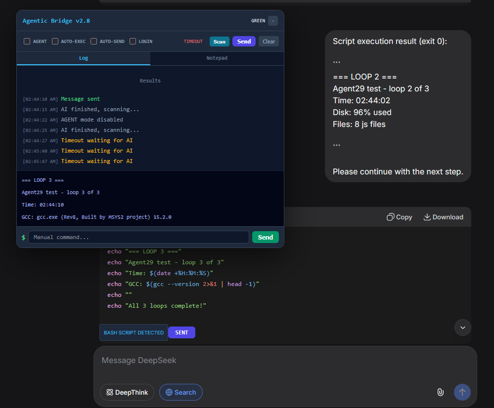

# Agentic Bridge

Connect DeepSeek AI chat to your local MSYS2 terminal. AI writes bash scripts, bridge executes them on your system, results flow back automatically.

## How it works

DeepSeek AI generates a bash script in chat. The bridge detects it, adds an EXEC BASH button, runs it on your MSYS2 system via WebSocket, and sends output back to the chat. In AGENT mode this loops automatically.

## Setup

1. Install userscript in Tampermonkey (active on chat.deepseek.com)
2. Install: mingw-w64-ucrt-x86_64-python-websockets
3. Start: python3 bridge_msys2_ucrt64.py
4. Open https://chat.deepseek.com

## Modes

- AGENT - Full auto loop (exec + send + continue)
- AUTO-EXEC - Execute scripts automatically
- AUTO-SEND - Send results back automatically
- LOGIN - Use bash login shell
- Scan - Manually find scripts

## Patch Workflow

All file changes use diff/patch for clean reversible edits:

    diff -u old new > fix.patch    # create
    patch file < fix.patch         # apply
    patch -R file < fix.patch      # undo

## Audit Logs

Bridge logs to agent_logs/ with timestamps and colored output:
- [READ] green - command received
- [WRITE] red - result sent

## Files

| File | Purpose |
|------|---------|
| agentic_bridge_deepseek.js | Browser userscript |
| bridge_msys2_ucrt64.py | WebSocket server |
| prompt.txt | AI system prompt |
| pic.jpg | Screenshot |
